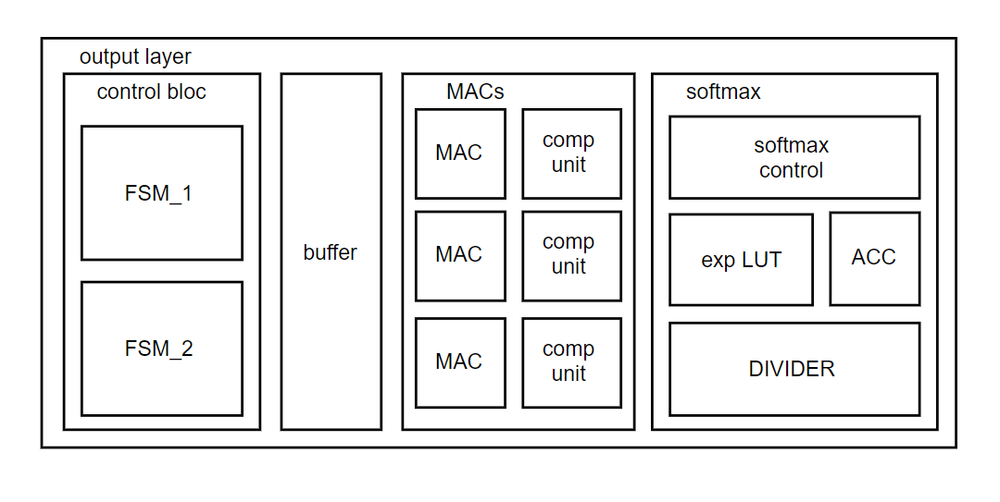

# cnnGRUvhdl

## Project

Custom IP component for the acceleration of a low-precision CNN-GRU neural network architecture in inference mode. The component is integrated in both DE10-Standard and DE10-Nano boards by Terasic, including IntelFPGA's CycloneV SoC.
The accelerator was designed for real-time scalp EEG epileptic seizure prediction. Potential applications include closed-loop neuro-stimulation for the prevention of onsets in cases patients are unresponsive to medication (about 30%), and acceleration of automatized seizure prediction/detection for assistance in medical environment.

## Project block diagram

wired ethernet TCP communication (programmed in C) between a PC and an ARM-A9 cortex on the CycloneV 5 -> enables off-board data storage

ARM-A9 cortex: NN parameters storage in on-chip RAM, file parsing and data sending to on-chip RAM memory (inside the FPGA).

FPGA accelerator: handles the forward pass of the neural network in real-time

## Accelerator architecture

Components: - on-chip RAM memory for parameter and input data storage
            - multiply & accumulate units array (MAC) for matrix-vector and hadamard products
            - quantization units for reduced precision quantization and activation functions (hard sigmoid, hard tanh, relu)
            - local maximum units array for maximum pooling layer
            - softmax activation function (exponential LUT, divider, accumulator, control block)
            - FIFO: data reordering in flattening layer (before GRU)
            - regs: Conv2D parameters, intermediate results in GRU layer
            - Control blocks: algo_control (top-level), conv2d_control, conv2d_output_control, serializer (flattening layer control), gru_control, dense (output layer control).
            - RAM wrapper: routing of on-chip RAMs with Avalon bus
            - avalon slave interface: control & status signals, addresses (communication with ARM-A9 cortex)
            

### Conv2D layer
 

### GRU layer
The GRU layer implements the forward pass equations in reduced-precision version (hard sigmoid replacing sigmoid, hard tanh replacing tanh and quantization after computation of z, r, h and s.
z : update gate
r : reset gate
h : computed next state of the cell
s : current state of the cell

Forward pass equations (full-precision)

time breakdown in GRU layer for first timestep

time breakdown in GRU layer for n_th timestep except first

### Flattening
Data needs to be reorganized in memory before GRU can be applied to it, because the model includes a flattening layer which flattens out a 3D matrix (batch size, channels, filters) into a 1D vector obtained by inserting the 3rd dimension into the 2nd and the resulting 2nd dimension into 1st.

 

### Output layer
The output layer is a dense layer (fully connected linear layer) coupled to a softmax activation, resulting into a multi-class output. This project considers 3 classes: - inter-ictal : healthy condition of the patient
                                  - pre-ictal : period preceeding a seizure
                                  - ictal : epileptic onset

Output layer top level architecture

Sotfmax datapath

